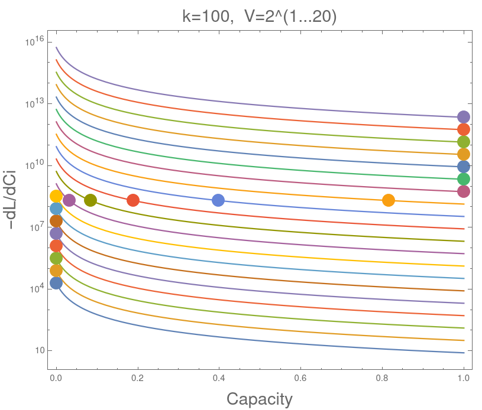
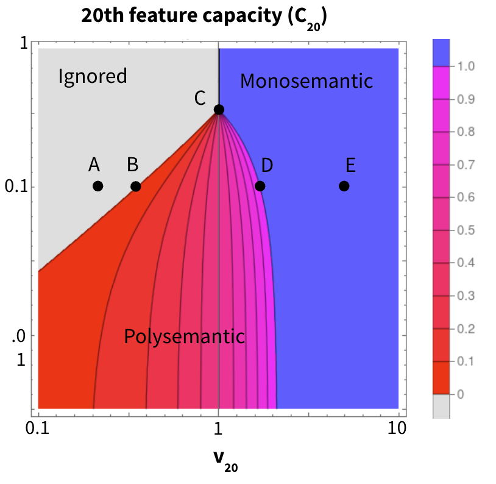
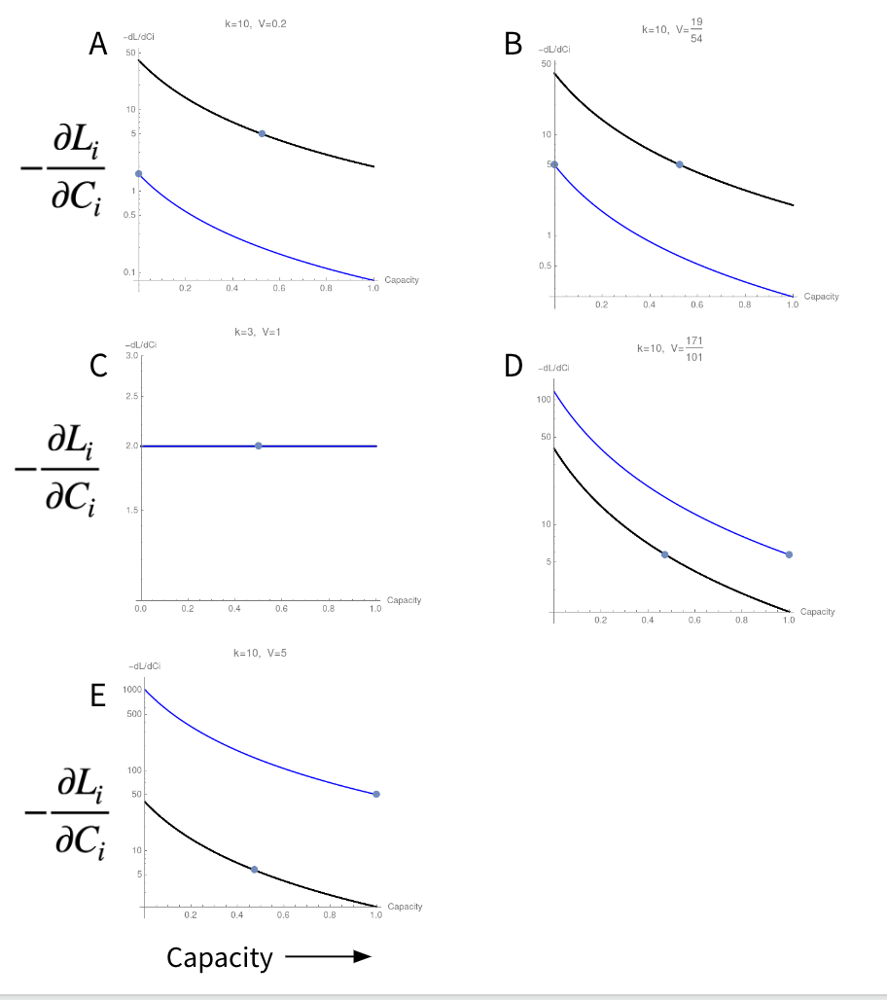

```python
import itertools
import os
from typing import Any, Callable, cast
import matplotlib.pyplot as plt
import numpy as np
import plotly.express as px
import plotly.graph_objects as go
from ipywidgets import interact
from sympy import Add, Basic, Expr, Function, Mul, Pow, Symbol, symbols
import w1d5_test

MAIN = __name__ == "__main__"
IS_CI = os.getenv("IS_CI")

```

# W1D5 - Cumulants and Polysemanticity

## Table of Contents

- [The "what" and "why" of cumulants](#the-what-and-why-of-cumulants)
- [Doing some decompositions](#doing-some-decompositions)
- [Generalizing to more variables](#generalizing-to-more-variables)
- [Marginal Distributions](#marginal-distributions)
    - [Going even further](#going-even-further)
    - [Tying it back to the point of all this](#tying-it-back-to-the-point-of-all-this)
- [Cumulant Proof Exercises](#cumulant-proof-exercises)
- [Cumulant Coding Exercises](#cumulant-coding-exercises)
    - [Crash Course in SymPy](#crash-course-in-sympy)
    - [Helper Functions](#helper-functions)
    - [Sum of Products](#sum-of-products)
    - [Cumulants of a Bernoulli](#cumulants-of-a-bernoulli)
    - [Product Rule](#product-rule)
    - [Gaussian-Bernoulli Cumulants](#gaussian-bernoulli-cumulants)
- [Polysemanticity](#polysemanticity)
    - [What is polysemanticity?](#what-is-polysemanticity)
    - [When would we expect models to be mono/polysemantic](#when-would-we-expect-models-to-be-monopolysemantic)
    - [Epistemic status](#epistemic-status)
- [Toy Model 1](#toy-model-)
    - [Exercise](#exercise)
    - [Exercise](#exercise-)
    - [Exercises](#exercises)
    - [Exercises](#exercises-)
- [Toy Model 2](#toy-model-)
    - [Exercises](#exercises-)
- [Capacities](#capacities)
    - [Exercises](#exercises-)
    - [Further directions](#further-directions)
- [Bonus](#bonus)

## The "what" and "why" of cumulants

We often find ourselves sampling some number of random variables, whose distributions we know or can approximate, performing various computations on them that combine them together, and getting some value as a result. For instance, we might have some $X_1$, $X_2$, and $Y$, calculate some $\hat Y = aX_1 + bX_2 + c X_1X_2$, then calculate the loss $L=(Y - \hat Y)^2$. The result of our computation, which in this case is $L$, is itself a random variable, and we often want to determine its distribution. Importantly, as the example hints, this is true of comparing a model output to a true $Y$; we'd like to know the distribution of the loss of the model when fed a distribution of inputs, or at least a fact about that distribution, like its expectation. But more importantly, we'd really like to be able to give *reasons* why a fact is true in terms of facts about the model and facts about the distribution of our inputs. What properties of the input distribution is the expected loss most sensitive to? Is it the size of one of the input variables? Or some interaction between them? These are the questions we'd like to have a more formal way of answering.

One way of getting at this is to decompose the expectation (we'll stick to the expected loss for now) into a sum of terms that each refer to different properties of the input distributions. Then we'd be able to look at these terms, notice which terms are big and which are small, and use this to get a sense of what the model's output is based on. Then we could reason about what traits of the input distribution have the most substantial effects on the expectation of the output, and therefore how the output would chance in response to distributional shift (i.e. changing traits of the input distribution).

One example of this sort of work is the transformer circuits research from Anthropic, which breaks down a transformer's output into the contributions of various heads, and tries to understand each head's contribution. The Redwood interpretability team is trying to generalize this strategy to circumstances where values are being combined with non-linear functions. This is closely related to the Alignment Research Center's attempts (which will be described in a future ARC report) to use heuristic arguments to address the [ELK problem](https://docs.google.com/document/d/1WwsnJQstPq91_Yh-Ch2XRL8H_EpsnjrC1dwZXR37PC8/edit).


## Doing some decompositions

Depending on what operations were performed on the input nodes in order to compute the output nodes, this task ranges in difficulty. For instance, if the output node is some linear combination of the input nodes, like $Z=aX+bY$, we're in luck, as
$$E[Z]=aE[X]+bE[Y]$$

But if instead we have $Z=XY$, life is more difficult. When $X$ and $Y$ take on values independently of one another, then $E[Z]=E[X]E[Y]$. But when $X$ and $Y$ tend to vary in the same direction (both greater, or both lesser) away from their respective means, the mean of their product is higher than the product of their separate means. And if they tend to vary together in opposite directions from their mean, then the mean of their product will be less than the product of their means. We call the alteration to $E[XY]$ away from the "baseline" of $E[X]E[Y]$, caused by these two's tendency to vary together, the covariance of $X$ and $Y$. So:

$$E[Z] = E[XY] = E[X]E[Y] + \text{Cov}[X,Y]$$

This is _a_ decomposition of $E[Z]$ into traits of the input distribution, but what do each of these terms mean? Suppose $E[XY]$ is large and positive. You can think of the two terms on the RHS (right-hand side), $E[X]E[Y]$ and $\text{Cov}(X,Y)$, as being two explanations for this value. If the first is big and the second is negligible, then $E[XY]$ is big because $X$ and $Y$ are centered in a region of $\mathbb R^2$ with high positive product. In this case, the way in which $X$ varies does not correlate strongly to how $Y$ varies and vice versa. If $E[X]E[Y]$ is small and the covariance is large, then this indicates that the high $E[XY]$ comes from these two variables interacting in such a way that has them fall in regions with $XY>E[X]E[Y]$ more often(/with higher magnitude) than regions with $XY< E[X]E[Y]$. Equivalently, for zero-mean random variables, covariance tells you how to use information about the direction away from 0 of one variable to predict the direction of the other.

Note that covariance is tracking one degree of freedom of the information contained in the joint distribution of these two variables that is lost when you look at each of their distributions separately; it's tracking all the lost information about the expected product of the two variables. In other words, you can think of $\text{Cov}[X,Y]$ as the contribution to $E[XY]$ that requires you to think about the interaction between $X$ and $Y$, rather than thinking about them separately. Notice also that the information in $\text{Cov}$ is added onto the information just in the expectations; i.e. information is accumulating.


```python
if MAIN:

    @interact
    def line(x_mean=(-3.0, 3.0), y_mean=(-3.0, 3.0), cov=(-0.99, 0.99)):
        """
        Interactive covariance widget for Gaussian/normal random variables with a variance of 1. Drag the x_mean, y_mean, and cov variables to adjust the mean of each random variable and covariance between them, respectively.
        """
        plt.rcParams["figure.figsize"] = (8, 5)
        cov_matrix = np.eye(2) + np.array([[0, cov], [cov, 0]])
        data = np.random.multivariate_normal(np.array([x_mean, y_mean]), cov_matrix, 200)
        plt.scatter(data[:, 0], data[:, 1])
        plt.title("Generated Data")
        plt.axis("equal")
        plt.xlabel("X")
        plt.ylabel("Y")
        plt.xlim(-6, 6)
        plt.ylim(-6, 6)
        print("Covariance matrix:\n", cov_matrix)

```

## Generalizing to more variables

If instead we have three variables multiplied together, e.g. $W=XYZ$, we're going to need a different strategy for decomposing $E[W]$ into traits of the input variables' distributions. Luckily, covariance naturally generalizes to the third cumulant, $\kappa(X,Y,Z)$, which contains the information about $E[XYZ]$ that is still left over once we've taken into account every other [partition](https://en.wikipedia.org/wiki/Partition_of_a_set) of the three variables.

$$E[XYZ] =E[X]E[Y]E[Z]+E[X]\text{Cov}(Y,Z)+E[Y]\text{Cov}(X,Z)+E[Z]\text{Cov}(X,Y)+\kappa(X,Y,Z)$$

Let's understand what this decomposition of $E[W]$ into traits of the inputs has brought us. Suppose that $E[XYZ]$ is large and positive. Again, these terms correspond to various explanations of that fact. If the first term is also large and positive and the others are neglible, this means that the centers of the distributions of these three variables is in a region of $\mathbb R^3$ that has large positive product, and that the variables don't tend to vary in unison in a way that alters their average product much. If one of the middle terms, say $E[X]\text{Cov}(Y,Z)$, is large and the rest are neglible, this means that these mean of their expectations isn't that high, but that the high $E[XYZ]$ is caused by some combination of the mean of $X$ being high, and $Y$ and $Z$ tending to vary away from their means in high-product directions. But if the final term, the "3-way cumulant" is high, and the others are negligible, this means that the variables are centered near the origin, and no pair of them tend to vary in any particular direction together, but that there's an irreducibly threeway interaction in which they fall in positive-product regions more often than negative-product regions.

Just like how $\text{Cov(X, Y)}$ is $0$ if $X$ and $Y$ are independent, $\kappa(X,Y,Z)$ is $0$ if the pairwise dependencies capture all the relevant information about the way $X$, $Y$, and $Z$ interact. And in cases where the pairwise interactions lose information about the joint distribution that affects $E[XYZ]$, this cumulant will be non-zero. Let's see an example where the third cumulant really matters. Suppose you sample points from three i.i.d. uniform distributions, and plot their values in $\mathbb R^3$. You get a cube, like this:


```python
if MAIN:
    (x, y, z) = np.random.uniform(-1, 1, (3, 1000))
    fig = px.scatter_3d(x=x, y=y, z=z, color=x * y * z, color_continuous_scale="delta")
    if not IS_CI:
        fig.show()

```

$\mathbb R^3$ can be divided up into 8 octants, just as the Euclidean plane can be divided into quadrants. In half of these, the product of $(x,y,z)$ is positive, and in the other half, this product is negative. I've colored samples by their product: green is positive and blue is negative. If you remove all the points with negative product from this dataset, you cut 4 corners out of this cube, leaving four behind.


```python
if MAIN:
    mask = x * y * z > 0
    x_new = x[mask]
    y_new = y[mask]
    z_new = z[mask]
    fig = px.scatter_3d(
        x=x_new, y=y_new, z=z_new, color=x_new * y_new * z_new, range_color=(-1, 1), color_continuous_scale="delta"
    )
    if not IS_CI:
        fig.show()

```

## Marginal Distributions

Let's look at the marginal distributions of these two distributions:


```python
if MAIN:
    plt.scatter(x, y)
    plt.title("X vs Y - Full Cube")
    plt.xlabel("X")
    plt.ylabel("Y")
    plt.show()
    plt.scatter(y, z)
    plt.title("Y vs Z - Full Cube")
    plt.xlabel("Y")
    plt.ylabel("Z")
    plt.show()
    plt.scatter(x, z)
    plt.title("X vs Z - Full Cube")
    plt.xlabel("X")
    plt.ylabel("Z")
    plt.show()
if MAIN:
    plt.scatter(x_new, y_new)
    plt.title("X vs Y - Four Corners")
    plt.xlabel("X")
    plt.ylabel("Y")
    plt.show()
    plt.scatter(y_new, z_new)
    plt.title("Y vs Z - Four Corners")
    plt.xlabel("Y")
    plt.ylabel("Z")
    plt.show()
    plt.show()
    plt.scatter(x_new, z_new)
    plt.title("X vs Z - Four Corners")
    plt.xlabel("X")
    plt.ylabel("Z")
    plt.show()
    plt.show()

```
Their marginal distributions are the same! In both cases, all three variables have mean 0 ($E[X]=E[Y]=E[Z]=0$), and they both have all of their covariances $=0$, so $E[XYZ]=\kappa(X,Y,Z)$. But when we cut out those corners, $E[XYZ]$ will be positive, as these points dwell exclusively in the octants of $\mathbb R^3$ with positive product, whereas $E[XYZ]=0$ in the original distribution.
So the difference in $E[XYZ]$ between these distributions is explainable not by looking at the two- or one-variable marginals, but only by the irreducibly 3-way interaction between them captured by the third cumulant. The reason information got lost here is because task of determining whether $E[XYZ]$ will be positive or negative relies on knowing the signs of all three of these variables. When we marginalize down to two dimensions we combine regions with positive and negative product, losing the information that distinguishes them.

**The third cumulant provides information about each variable that can condition on both of the other variables.** As we saw in the above graphs, sometimes conditioning on $Y$ or $Z$ would tell you nothing about $X$. But, armed with the value of the 3-way cumulant, you can learn things about $X$ by conditioning on $Y$ and $Z$. For instance, if you know both the signs of $Y$ and $Z$ and $\kappa(X,Y,Z)$, you can know the sign of $X$ with certainty.

### Going even further

We can generalize to "$n$-way cumulants", $\kappa(X,Y,Z, ...)$ which measure the irreducibly $n$-way interaction between random variables, just like covariance captures irreducibly 2-way interaction and the third cumulant captures 3-way interaction. Expectation and covariance are special cases of this cumulant, i.e. $\kappa(X)=E[X]$ and $\kappa(X,Y)=\text{Cov}(X,Y)$, so I'll mostly use the cumulant notation from now on. We can rewrite our definition of the three-way cumulant as:

$$E[XYZ] =\kappa(X)\kappa(Y)\kappa(Z)+\kappa(X)\kappa(Y,Z)+\kappa(Y)\kappa(X,Z)+\kappa(Z)\kappa(X,Y)+\kappa(X,Y,Z) $$

And the general $n$-way cumulant is:

$$
E[X_0 ... X_n]=\sum_{\pi \in P}\prod_{b\in \pi}\kappa(*b) \implies
$$

$$
\kappa(*\{X_i\}) =  E[X_0 ... X_n] - \sum_{\pi \, \in \, P \setminus \{X_i\}} \prod_{b \in \pi}\kappa(* b)
$$

$P$ is the set of all [partitions](https://en.wikipedia.org/wiki/Partition_of_a_set) of $\{X_1, ...,X_n\}$, so each element $\pi$ is a set of subsets of $\{X_1, ...,X_n\}$. $b$ iterates over all the subsets in each partition $\pi$, then we're taking the cumulant of all the random variables in the subset $b$. $*$ refers to the "unpacking" operation (syntax borrowed from Python), in which we take all the elements of a list/set and make them each their own argument to the function $\kappa$. Make sure you can see how the three-way cumulant definition we gave a second ago is a special case of the above formula. Note that we don't specify the order of unpacking. This is because cumulants are invariant to the order of their arguments.

Higher-order cumulants appear naturally if we try to break down the expectation of a product of many random variables into a sum of components, like we've been doing all along. They make large contributions to this expectation in situations the output value is sensitive to the coordinated variation of many variables at once.

### Tying it back to the point of all this

We want a decomposition of $\mathbb E[L]$ into more human-interpretable pieces so we can understand what parts of the input distribution the model depends on. A sum of things is interpretable because you can check which terms are large and which are negligible. Cumulants are interpretable because they more-or-less correspond to a natural decomposition of things the model could care about: it could care about the individual distributions of the random variables, or it could care about the interactions between variables. It might not care at all about the interaction between some $X$ and all the other inputs, but be very sensitive to the covariance between $Y$ and $Z$.

Suppose we broke down the expected loss into joint moments instead. Cumulants are not a perfect decomposition, but they seem better than joint moments. The reason for this is that $\mathbb E[XY]$ seems intuitively to be mixing together information about the marginal distributions with information about the covariance between the two. In other words, it contains lots of duplicate information with other terms in our sum, namely the terms containing $\mathbb E[X]$.

<!-- ### Fun Cumulant Facts that are not necessary:

Another way of deriving the cumulants of a distribution is from the Cumulant Generating Function, which is $\log E[e^{tX}]$. This function of $t$ has some Taylor expansion (around 0) of  $c+K(X)\frac{t}{1!} + K(X,X)\frac{t^2}{2!}+...$. As you can see from my suggestive notation, the coefficients on this expansion equal the cumulants of the distribution. You can extract the $n$th cumulant by taking the $n$th derivative w.r.t. $t$ of the CGF then plugging in $t=0$.

If you would like to generate all the various joint cumulants of multiple (say, $m$) random variables at at the same time, the CGF $G(\phi)$ becomes $\mathbb R^m\to\mathbb R$, so its expansion is of the form $c +\frac{1}{1!}\sum_iK(X_i)\phi_i+\frac{1}{2!}\sum_{ij}K(X_i, X_j)\phi_i\phi_j + ...$ Similarly, you can extract all the $n$th cumulants (both joint and non-joint) by taking the gradient $n$ times and plugging in $\phi=0$.

Here are two rules for getting cumulants of expressions of random variables in terms of expressions of cumulants of random variables:

Sum rule: $K(cA+B,*S)=cK(A,*S)+K(B,*S)$. $*S$ stands for any number of additional arguments. This is a generalization of linearity of expectation, and multilinearity of covariance.


A Gaussian has cumulants $[\mu, \sigma^2, 0, 0, ...]$. It is the only distribution with those cumulants.

A set of cumulants do not always uniquely specify a distribution. -->


## Cumulant Proof Exercises


For all of the following proofs, use just enough rigor to convince yourself why these results hold. Pay attention to the definition of the "product rule" in exercise 3; you will need it for the coding exercises.

1. Find $\kappa(X)$, $\kappa(X,X)$, $\kappa(X,X,X)$ for $X\sim\text{Bern}(p)$. Note that $E[X^n]=p$.
    <details>
    <summary> Answer  </summary>
    Values:

    $\kappa(X)=p$,

    $\kappa(X,X)=K[X^2]-K[X]^2=p(1-p)$,

    $\kappa(X,X,X)=\kappa(X^3)-(\kappa(X)^3+3\kappa(X)\kappa(X,X)) = p - (p^3 + 3p^2(1-p)) = p - 3p^2 + 2p^3 = p(1-p)(1-2p)$
    </details>

<!-- 2. Using the sum-of-products definition, prove that cumulants are invariant to changes in the order of their arguments.
    <details>
    <summary> Answer </summary>
    $ \kappa(*[X_i]) = E[\prod_i X_i]- (\sum_{\pi \; \in \;  P(\{X_i\}) \setminus \text{"all separate"}}  \prod_{b \in \pi}\kappa(\{X_i \; : \; i \in b\})) $
    The product in the the first term is order-invariant. The set of set-partitions are order invariant too. In fact, just from the claim that expectation is equal to this formula of cumulants no matter how you arrange the arguments within each cumulant, we can tell that order doesn't matter.
    </details> -->


2. Using the provided definition of the nth cumulant (see "the general n-way cumulant" above), prove inductively that cumulants are linear in their first argument, i.e. that $\kappa(cA+B,*S)=c\kappa(A,*S)+\kappa(B,*S)$. With the order-invariance of cumulance, we conclude that cumulants are multilinear, i.e. linear in each of their arguments.

    <details>
    <summary> Answer </summary>

    Part 1:

    Proving that $\kappa(cX,*S)=c\kappa(X,*S)$ for any S:

    Base case: $S = []$, $\kappa(cX,*S)=\mathbb E[cX] = c\mathbb E[X] = c\kappa(X,*S)$ by linearity of expectation.

    Inductive hypothesis: $\kappa(cX,*S) = c\kappa(X,*S)$ if len($S$) $\leq n$.

    Assume len($S$) = $n + 1$. $\kappa(cX,*S)=\kappa(cX\prod_i S_i) - (\sum_\pi \prod_{b \in \pi} \kappa(*b))$

    Pull out the $c$ from the $\kappa(cX\prod_i S_i)$ term by linearity of expectation. $cX$ shows up once in each term in the sum, as it is in exactly one subset in each partition. Rearrange the arguments in each cumulant that $cX$ is in s.t. $cX$ is the first argument. You can pull it out of that cumulant (which has $n$ or fewer arguments in $S$) by the inductive hypothesis. Then each summed term on the RHS has exactly one $c$, so you can factor it all the way out and get $c\kappa(X,*S)$


    Part 2: $\kappa(X + Y, *S) = \kappa(X,*S)+\kappa(Y,*S)$

    Same structure argument as the above.

    Base case: $S = []$, $\kappa(X + Y,*S) = \mathbb E[X + Y] =\mathbb E[X] + \mathbb E[Y] = \kappa(X,*S) + \kappa(Y,*S)$

    IH: $\kappa(X + Y,*S) = \kappa(X,*S) + \kappa(Y,*S)$ when len($S$) $\leq n$.

    Inductive step: $\kappa(X + Y, *S) = \kappa(X\prod_i S_i + Y\prod_i S_i) - \sum_\pi \prod_{b \in \pi} \kappa(*b) = $

    The ffirst term divides into $\kappa(X,*S)+\kappa(Y,*S)$ by linearity of expectation. All the other terms in the sum have exactly one instance of $X+Y$, as it appears in exactly one subset in each partition. The cumulant it appears in can be divided into $\kappa(X,*T) + \kappa(Y,*T)$ by the IH. So each term on the RHS splits in two, and you get $\kappa(X,*S)+\kappa(Y,*S)$

    </details>

3. Using the definition of covariance and the definition of $\kappa(X, Y, Z)$, prove that $\kappa(XY, Z)= \kappa(X,Y,Z) + \kappa(X)\kappa(Y,Z) + \kappa(Y)\kappa(X,Z)$

    <details>
    <summary> Answer </summary>
    Proof:

    $\kappa(XYZ)=\kappa(XY)\kappa(Z)+\kappa(XY,Z) = \kappa(X)\kappa(Y)\kappa(Z)+\kappa(X,Y)\kappa(Z)+\kappa(XY,Z)$ \
    This is by application of the fact that $\kappa(XY) = \kappa(X)\kappa(Y) + \kappa(X,Y)$ \
    $\kappa(XYZ)=\kappa(X)\kappa(Y)\kappa(Z)+\kappa(X)\kappa(Y,Z)+\kappa(Y)\kappa(X,Z)+\kappa(Z)\kappa(X,Y)+\kappa(X,Y,Z)$ \
    This is by the definition of the $n$th cumulant. \
    Subtract the first from the second, you get \
    $0=-\kappa(XY,Z) + \kappa(X)\kappa(Y)\kappa(Z)+\kappa(X)\kappa(Y,Z)+\kappa(Y)\kappa(X,Z) +\kappa(X,Y,Z)$ \
    $\kappa(XY,Z) = \kappa(X)\kappa(Y,Z)+\kappa(Y)\kappa(X,Z) +\kappa(X,Y,Z)$
    </details>

    This, along with the fact that $\kappa(XY)=\kappa(X,Y)+\kappa(X)\kappa(Y)$ (a fact that should look familiar once you translate into expectations and covariances), is a special case of a property of cumulants that we will not prove:

    _Product rule_: $\kappa(AB,*S)=\kappa(A,B,*S)+\sum_{T \subseteq S}\kappa(A,*T)\kappa(B,*(S \setminus T))$.\
    $T$ iterates over all subsets of the remaining arguments, $S$.

4. Prove via induction (hint: using the above product rule) that $\kappa(X, *S)=0$ if $\forall i, \; X\perp S_i$ ($X$ independent of $S_i$), $\text{len}(S)>0$.

    <details>
    <summary>Answer:</summary>

    Base case: $S=[Y]$. $\kappa(X,Y)=\mathbb E[XY] - \mathbb E[X]\mathbb E[Y]= \mathbb E[X]\mathbb E[Y] - \mathbb E[X]\mathbb E[Y] = 0$

    Inductive Hypothesis: $\kappa(X, *S)=0$, $\forall S$ s.t. $\text{len}(S)\leq n$.

    Let $T$ be a list of random variables s.t. $\text{len}(T)=n+1$.

    Let $S'$ be the list of random variables s.t. $S'_0=T_0*T_1$ and $\forall i$ s.t. $0 < i <n+1$, $S'_i=T_{i+1}$

    By the product rule, $\kappa(X, S')=\kappa(X, T_0, T_1, *S[1:])+\sum_{T'\subseteq{X}\cup S[1:]} \kappa(T_0, *T')\kappa(T_1,*T'^C)$

    For each term in the $\sum$, exactly one of the factors contains $X$. Since $S'$ is a list of $n$ elements, $X\cup S'[1:]$ is also of size $n$. So the unpacked list the cumulant containing $X$ will have at most $n$ elements in it, one of which is $X$, plus the cumulant contains one of $T_0$ or $T_1$, for a total of at most $n$ arguments in the cumulant that aren't $X$. By the inductive hypothesis, this cumulant will be $0$. Also $\kappa(X,S')=0$, since $S'$ also contains $n$ arguments other than $X$, so the IH also applies.

    Thus $\kappa(X, T_0, T_1, *S[1:])=\kappa(X,*T)=0$.

    Thus the theorem holds $\forall n$.
    </details>

5. Using the fact that $\text{Cov}(X,Y)=0$ for independent $X$,$Y$ and using the definition of the cumulant, prove via induction that $\kappa(\underbrace{X, X, ...}_\text{n}, \underbrace{Y, Y, ...}_\text{m})=0$ for independent $X$, $Y$.

    <details>
    <summary> Answer </summary>
      Base case:

      $\kappa(X,Y) = 0$ \
    IH: $\kappa(\underbrace{X, X, ...}_\text{n'}, \underbrace{Y, Y, ...}_\text{m'})=0$ if $n' < n$ or $m' < m$. \
    $\kappa(X,X,...,Y,Y,...) = \kappa(X^nY^m) - (\sum_{\pi_X\in P(\{X_i\} \cap \{Y_i\})} \prod_{b\in\pi}\kappa(*b)) $ \
    $\kappa(X,X,...,Y,Y,...) = \kappa(X^nY^m) - (\sum_{\pi_X\in P(\{X_i\})} \prod_{b_X\in\pi_X}\kappa(*b_X))(\sum_{\pi_Y\in P(\{Y_i\})} \prod_{b_Y\in\pi_Y}\kappa(*b_Y)) $ \
    This maneuver is due to the fact that any partition that puts an $X$ and a $Y$ in the same subset will be 0 by the IH, so the only partitions left are those that partition all the $X_i$ and $Y_i$ separately. These can be factored, as each partition of $X_i$ can go along with every possible partition of the $Y_i$. \
    $\kappa(X^nY^m) = \kappa(X^n)\kappa(Y^n) = (\sum_{\pi_X\in P(\{X_i\})} \prod_{b_X\in\pi_X}\kappa(*b_X))(\sum_{\pi_Y\in P(\{Y_i\})} \prod_{b_Y\in\pi_Y}\kappa(*b_Y))$ \
    This is just by expanding each expectation as a sum of cumulant-products. \
    So the two parts of the RHS cancel, and $\kappa(X,X,...,Y,Y,...) = 0$
    </details>

 


## Cumulant Coding Exercises

We'll be using the [SymPy library](https://docs.sympy.org/latest/index.html) to represent algebraic expressions.

### Crash Course in SymPy

Use `symbols` to declare symbols. SymPy will automatically simplify expressions, which can be surprising at first.

Types in SymPy are somewhat complicated.
- Symbolic expressions all inherit from `Basic`, which is a node in a tree structure. The `args` field contains the children of the node, so `(x+y).args` are a tuple of x and y. If you're not sure what type something is, `Basic` is a safe bet.
- `Expr` inherits from `Basic` and provides arithmetic operations.
- Many things inherit from `Expr`, like:
    - (x*3) of type `Mul`
    - (x+y) of type `Add`
    - x of type `Symbol`
- Writing (x + 3) will make an Add instance where the arg 3 is no longer `int` but actually `Integer`. `Integer` is another `Expr` subclass, but its args are just the empty tuple.
- Sometimes the `args` field will contain objects of type `Basic`, but you know they should be `Expr`. It's okay to use `cast(Expr, obj)` here.
- When we declare a symbolic function like `K` below, it returns an object of type `UndefinedFunction`. An expression like `K(x, y)` is of type `K`, which is pretty fancy: sympy has generated a new type at runtime for us.

If you feel confused about the hierarchy of an object, you can use `type(obj)` to see its type, and `type(obj).__mro__` to see its method resolution order.


```python
(x, y, z, p) = symbols("x y z p")
w = x * x + x * y + z
K = cast(Callable, Function("K"))


def isinstance_k(obj: Any) -> bool:
    """Return True if obj is an instance of K. For example, K(x, y) is an instance of K, but K itself is not."""
    return isinstance(obj, K)


if MAIN:
    print("SymPy will automatically simplify expressions like x*x: ", w)
    print("You can substitute expressions like this: ", w.subs(x, 3))
    print("The type of x * 3 is: ", type(x * 3))
    print("The type of x + x is (surprise!): ", type(x + x))
    print("The type of x * x is (surprise!)", type(x * x))
    print("You can inspect the args property of an expression: ", (x * y).args)
    print("Args of (x*x) is: ", (x * x).args)
    print("Args of K(x, y, z) is: ", K(x, y, z).args)
    print("K called with arguments returns a result of type K: ", isinstance_k(K(x, y)))
    print("The subs function works on expressions: ", (K(x) + y).subs(K(x), 4))

```

### Helper Functions


```python
def monomial_to_list(expr: Expr) -> list[Expr]:
    """
    expr: a monomial in sympy, e.g. "x", "x*y", "x**2*y"

    Returns: a list of sympy symbols that can be multiplied together to form the monomial expr. Length of this list == degree of monomial

    Examples:
    - monomial_to_list(x) == [x]
    - monomial_to_list(x**3) == [x, x, x]
    - monomial_to_list(x**3*y*z) == [x, x, x, y, z]
    """
    if isinstance(expr, Symbol):
        return [expr]
    if isinstance(expr, Pow):
        return [expr.args[0]] * expr.args[1]
    if isinstance(expr, Mul):
        return list(itertools.chain.from_iterable(map(monomial_to_list, expr.args)))
    raise ValueError(expr)


def sympy_map(f: Callable, expr: Expr) -> Expr:
    """
    f: a function K -> any
    expr: a sympy expression containing some cumulants

    Returns: a sympy expression resulting from applying f to every cumulant (i.e. expr of type K) in the sympy expr

    Examples:
      sympy_map(lambda cumu: cumu ** 2, K(x,y) + K(x)K(y)) == K(x,y)**2 + K(x)**2 * K(y)**2
      sympy_map(lambda cumu: 0 if x in cumu.args else cumu, K(x,y) + K(y)**2) == K(y)**2
    """
    if isinstance_k(expr):
        return f(expr)
    elif type(expr) in {Add, Mul, Pow}:
        return type(expr)(*map(lambda x: sympy_map(f, cast(Expr, x)), list(expr.args)))
    return expr


def K_sort(*args: Expr) -> Expr:
    """
    Makes a cumulant with arguments sorted alphabetically

    Example: K_sort(y, x, x) == K(x, x, y)
    """
    return K(*sorted(args, key=str))

```

### Sum of Products

Write a function that takes in a cumulant of a monomial of random variables and outputs the equivalent expression composed of cumulants of individual random variables. This is the sum-of-products expression from a few paragraphs ago.

<details>
<summary>Hint: multiset partition pseudocode</summary>

Algo for generating the set of all partitions of the elts of a list x

    Base case: len(x) == 1:
        Return [x]
    Else:
        Let y = partition(x[1:])
        For each partition p in y:
            For each subset b in p:
                Append the partition formed by putting x[0] in b
                Append the partition formed by putting x[0] in its own subset
        return the partitions

</details>


```python
def expand_exp(exp: Expr) -> Expr:
    """
    exp: a sympy expression of type K with one argument, i.e. an expectation.
        That argument is a product of sympy variables.

    Returns: An equivalent sympy expression in which each cumulant has single variables as arguments, no monomials.
            Make sure to sort your cumulant args with `K_sort(*b)` where b is a list of sympy expressions

    Examples:
    - expand_exp(K(x**2)) == K(x)**2 + K(x,x)
    - expand_exp(K(x*y**2)) == K(x)*K(y)**2 + K(x)*K(y,y) + 2*K(y)*K(x,y) + K(x,y,y)

    """
    pass


if MAIN:
    w1d5_test.expand_exp_tests(expand_exp)

```

### Cumulants of a Bernoulli

If $X \sim \text{Bern(p)}$, $E[X^n]=p$ for any $n$. Use this fact, the `sympy_map` function, and `expand_exp` to calculate the first $n$ cumulants of a Bernoulli in terms of $p$.


```python
def bern_cumu(n: int) -> list[Expr]:
    """
    n: a natural number > 0
    Returns: a list of sympy expressions in terms of p, starting with "p", the expectation of a Bern

    Example: bern_cumu(3) == [p, p*(1-p), p*(p - 1)*(2*p - 1)]

    """
    pass


if MAIN:
    w1d5_test.bern_cumu_tests(bern_cumu)

```


### Product Rule

Write a function that takes in a cumulant expression of $n$ arguments, each of which is a monomial of random variables. Apply the product rule to get a polynomial in cumulants of lone random variables. Use `sympy_map` again.


```python
def prod_rule(cumu: Expr) -> Expr:
    pass


if MAIN:
    w1d5_test.prod_rule_tests(prod_rule)

```

### Gaussian-Bernoulli Cumulants

Write a function that takes a cumulant whose arguments are monomials in x and y, and evaluates that cumulant assuming that x is a standard Gaussian and y is a Bern(p). Standard Gaussians have $\kappa(x) = 0$, $\kappa(x, x) = 1$, $\kappa(x, x, x) = 0$, $\kappa(x,x,x,...) = 0$; you can hardcode this.


```python
def eval_gauss_bern_cumu(cumu: Expr) -> Expr:
    """
    cumu: a cumulant containing only xs and ys
    Returns: a sympy polynomial of p

    Examples:
      eval_gauss_bern_cumu(K(x,x)) == 1
      eval_gauss_bern_cumu(K(x*y)) == 0
      eval_gauss_bern_cumu(K(x*y,x)) == p
    """
    pass


if MAIN:
    w1d5_test.eval_gauss_bern_cumu_tests(eval_gauss_bern_cumu)

```

## Polysemanticity

(Text copied heavily from Kshitij Sachan):

### What is polysemanticity?

A *neuron* is the scalar output of a non-linearity in a neural network, and we say a neuron *fires* when that value is non-zero. In general usage, a *feature* is any real-valued function on the network's input. A neuron is polysemantic if its value depends on multiple *unrelated features*. In the real world, a polysemantic neuron might be one that takes on a high value when the input to the network contains huskies or Coca-Cola cans (found in the [OpenAI Microscope](https://microscope.openai.com/models)). In this case, the features are "contains a husky" (which we can suppose is [0,1] for each image) and "contains a Coca Cola can". These two features are unrelated to each other, so a neuron that turns on for either of them is polysemantic. In contrast, if a neuron fired in response to images of cats and dogs and hamsters, we might say that it is a "pet" neuron: not polysemantic, because the features are related.

Formalizing "unrelated features" is tricky in general. For our toy model, we'll call the inputs $x_i$ the "input features", and assume that $x_0$, $x_1$, etc, are all "unrelated" to each other. Any subsequent use of the term "feature" in these instructions will refer only to these input features. Thus for the toy model, **a neuron is polysemantic if it is a function of multiple input features.**

### When would we expect models to be mono/polysemantic

Suppose there is a true value $y$ for a given vector-valued input $x$, and the model is supposed to predict it, producing estimate $\hat y$. One way to think about what your model is learning is that it's trying to match the dependencies (i.e. correlations/cumulants) between $\hat y$ and the features of $x$ (remember, "features" just means components of the input vector!) to all be equal to the cumulants between $y$ and $x$.  If there are many, many dependencies between the features  of $x$ and the true value $y$, your model may not be capable of accurately tracking them all. Monosemanticity then can be reframed as the matching of some dependencies perfectly, while others are completely ignored due to low capacity. And polysemanticity can be seen as tracking many correlations at the cost of picking up dependencies between $\hat y$ and $x$ that were $0$ in the ground truth $y$. Which of these solutions to the diminished capacity problem is favored depends on traits of the distribution of $x$ as well as the distribution of $y|x$.

In other words, monosemanticity is favored when tracking a few important things perfectly is better than tracking many things and picking up lots of interference. Polysemanticity is favored when there's little interference from trying to track many things all at once.

<!-- To reiterate, we think of polysemanticity at a deep level as being this tradeoff between learning true correlations and picking up spurious correlations. The specifics of this tradeoff depend on the model architecture and loss function. -->

### Epistemic status

**The core concepts discussed here, e.g. polysemanticity, are directly inspired and informed by currently-unpublished work done at Anthropic by Chris Olah et al.**

The specific results presented here are based off the current state of ongoing research by Kshitij Sachan, Adam Jermyn and Adam Scherlis. Some definitions are imperfect, and some parts of the narrative are still a bit confused.

## Toy Model 1

As a concrete example of monosemanticity and polysemanticity, we introduce this model:

$$
y=ax_1^2+bx_2^2\\\tilde{y}=(cx_1+dx_2)^2+e=c^2x_1^2+d^2x_2^2+2cdx_1x_2+e
$$

 where $x_1,x_2$, our two input features, are independent and $\sim N(0,1)$. $y$ is the true distribution and $\tilde{y}$ is the model's guess at it; the learnable parameters of the model are $c,d,e$. We would like to minimize the mean squared error loss:

$$
L=\mathbb E_{x_1, x_2}[(y-\tilde{y})^2]
$$

$y$ contains two quadratic nonlinearities, but our model $\tilde{y}$ only has access to a single nonlinearity plus an error term, $e$. In other words, our model only has one neuron. For general values of $a,b$, because of the interaction term $2cdx_1x_2$, our model's $\tilde{y}$ can't perfectly represent $y$. However, we can find the optimal solution by finding all the local minima over $c,d,e$. In the case that $a>b$, the optimal solution to this model is monosemantic (see below). This is also an optimal solution when $a=b$, but not the unique one in that case.

$$
c=\sqrt{a}\\d=0\\e=b
$$

### Exercise

Our model is doing its best to bring correlations involving $\tilde y$ and $x_i$ as close as possible to those between $y$ and $x_i$. Express $\kappa(y, x_i^2) = \text{Cov}(y,x_i^2)$, $\kappa(\tilde y, x_i^2) = \text{Cov}(\tilde y,x_i^2)$, $\kappa(y, x_ix_j)$, $\kappa(\tilde y, x_ix_j)$ for $i\in{1,2}$, $j\neq i$ in terms of $a,b,c,d,e$. Assume $x_i$ are i.i.d. with mean 0, var 1, and $\mathbb E[x_i^4] = k$.

Hint: in this problem it's quickest to expand $\kappa(\alpha,\beta)$ as $\mathbb E[\alpha\beta] - \mathbb E[\alpha]\mathbb E[\beta]$

<details>
<summary>Answer:</summary>

$$
\begin{align*}
\kappa(y, x_1^2) &= \kappa(ax_1^2 + bx_2^2, x_1^2) \\
&= a\kappa(x_1^2, x_1^2) + b\kappa(x_2^2, x_1^2) \\
&= a(\mathbb E[x_1^4] - \mathbb E[x_1^2]^2) \\
&= (k-1)a \\
\kappa(y, x_2^2) &= (k-1)b \\
\kappa(\hat y, x_1^2) &= \kappa(c^2x_1^2 + d^2x_2^2 + 2cdx_1x_2, x_1^2)\\
&= c^2(k-1) + 2cd\kappa(x_1x_2, x_1^2) \\
&= c^2(k-1) + 2cd(\mathbb E[x_1^3x_2] - \mathbb E[x_1x_2]\mathbb E[x_1^2])\\
&= c^2(k-1) + 2cd(\mathbb E[x_1^3]\mathbb E[x_2] - \mathbb E[x_1]\mathbb E[x_2]\mathbb E[x_1^2])\\
&= c^2(k-1) \\
\kappa(\hat y, x_2^2) &= d^2(k-1) \\
\kappa(y, x_1x_2) &= a\kappa(x_1x_2, x_1^2) + b\kappa(x_1x_2, x_2^2)\\
&= 0 \\
\kappa(\hat y, x_1x_2) &= c^2\kappa(x_1x_2, x_1^2) + d^2\kappa(x_1x_2, x_2^2) + 2cd\kappa(x_1x_2, x_1x_2) \\
&= 2cd(\mathbb E[x_1^2x_2^2] - (\mathbb E[x_1x_2])^2)\\
&= 2cd(\mathbb E[x_1^2]\mathbb E[x_2^2] - (\mathbb E[x_1]\mathbb E[x_2])^2) \\
&= 2cd
\end{align*}$$

</details>

This solution is monosemantic: $y$ has two nonzero correlations with $y$ to track: $\kappa(x_1^2,y)$ and $\kappa(x_2^2,y)$, and $\tilde{y}$ replicates one of them exactly while ignoring the other entirely. Verify for yourself that $\kappa(x_1^2,y) = \kappa(x_1^2,\hat y)$

Now suppose our inputs $x_1,x_2$ are "sparse" in the sense of being zero with high probability (though still independent). Specifically, we'll say that $x_i \sim N(0,\sigma^2)\cdot \text{Bern}(p)$, where $B$ is a Bernoulli random variable.

### Exercise

Find the value of $\sigma^2$ that makes $\kappa(x_1, x_1) = \text{Var}(x_1) = 1$.

<details>

<summary>Answer</summary>

Let $N \sim \mathcal N(0, \sigma^2)$ and $B \sim \text{Bern}(p)$. Then $x_i = NB$.

$\mathbb E[x_i] = \mathbb E[N]\mathbb E[B] = 0$.

$\text{Var}(x_i) = \mathbb E[x_i^2] - \mathbb E[x_i]^2 = \mathbb E[x_i^2] = \mathbb E[N^2]\mathbb E[B^2] = \text{Var}(N)(0 * (1-p) + 1 * p) = p\sigma^2$

$\text{Var}(x_i) = 1 \implies \sigma^2 = \frac 1 p$

</details>

Then the optimal solution for sufficiently small $p$ is polysemantic, approaching:

$$
c=\sqrt a\\d=\sqrt b\\e=0
$$

We can tell an intuitive story for why the polysemanticity is preferred. When each $x_i$ being non-zero is very rare (small $p$), the simultaneous non-zeroness of both $x_i$ is even rarer ($p^2$). So the model does best by treating this occurrence as essentially impossible, meaning the effects of $c$ and $d$ on the $2cdx_1x_2$ term are ignored. In other words, it accepts a divergence between $\kappa(\hat y, x_1x_2)$ and $\kappa(y, x_1x_2) = 0$ in exchange for closely matching the other correlations.

But what's really going on here? Why is the solution to our loss different for a Bernoulli times a Gaussian and just a Gaussian? Our initial intuitive explanation was that one distribution is "sparser" than the other. But sparsity of a distribution feels somewhat unnatural. Would polysemanticity emerge if the distribution were often $0.01$, rather than often $0$? Would it still be acceptable to refer to that as "sparse"? Let's strip back a few assumptions and see what effect the distribution of $x_i$ is having on when it's a good idea to be polysemantic.

### Exercises

1. Find a $2\times 2$ symmetric matrix $D$ and a scalar $h$, each in terms of $a,b,c,d,e$ such that the loss is $E[(x^TDx-h)^2]$.

    <details>
    <summary>
    Answer
    </summary>

    $D_{11} = a - c^2$, $D_{12}=D_{21}=-cd$, $D_{22}=b-d^2$, $h=e$

    </details>

2. Assuming $x_i$ are i.i.d. with mean $0$ and variance $1$, expand the above out to prove that the expected loss equals $(k-1)\sum_iD_{ii}^2+(\sum_iD_{ii} - h)^2+2\sum_{i\neq j}D_{ij}^2$, where $k=E[x_i^4]$. Hint: this will be easier if you don't assume that $D$ is $2\times 2$, i.e. if you write the proof in terms of $D_{ij}$ instead of $a,b,c,d,e$.

    <details>
    <summary>
    Answer
    </summary>
    Proof:

    $\mathbb E[(x^TDx - h)^2] = \\
    \mathbb E[(\sum_{ij}D_{ij}x_ix_j - h )^2]= \\
    \mathbb E[\sum_{ijkl}D_{ij}D_{kl}x_ix_jx_kx_l - 2h\sum_{ij}D_{ij}x_ix_j + h^2]=\\
    \mathbb E[\sum_i D_{ii}^2x_i^4 + \sum_{i \neq j}[D_{ii}D_{jj}x_i^2x_j^2+2D_{ij}^2x_i^2x_j^2] -2h\sum_iD_{ii}x_i^2+h^2] = \\
    k\sum_i D_{ii}^2 + \sum_{i \neq j}[D_{ii}D_{jj}+2D_{ij}^2] -2h\sum_iD_{ii}+h^2 = \\
    (k-1)\sum_i D_{ii}^2 + \sum_{i,j}D_{ii}D_{jj}+\sum_{i\neq j}2D_{ij}^2 -2h\sum_iD_{ii}+h^2 = \\
    (k-1)\sum_i D_{ii}^2 + (\sum_{i}D_{ii})^2+2\sum_{i\neq j}D_{ij}^2 -2h\sum_iD_{ii}+h^2 = \\
    (k-1)\sum_i D_{ii}^2 + (\sum_{i}D_{ii}-h)^2+2\sum_{i\neq j}D_{ij}^2$
    </details>

Note that the optimal $h$ given $D$ will always be $\sum_iD_{ii}$, so we can write the loss just as function of $D$, i.e. $(k-1)\sum_iD_{ii}^2+2\sum_{i\neq j}D_{ij}^2 = (k-1)((c^2-a)^2+(d^2-b)^2)+4c^2d^2$


As $k$ increases, the first term matters more, and thus $c$ and $d$ are brought closer to $\sqrt a$ and $\sqrt b$, despite their effect on the final term in the loss. This is a polysemantic solution, as $c$ and $d$ are both non-zero, attempting to track the influence of both $x_1$ and $x_2$. But with smaller $k$, the penalty from the cross term $4c^2d^2$ becomes more onerous, so the optimal solution becomes monosemantic. In particular, Mathematica can tell you that when $k > 1 + 2\max(a/b, b/a)$, the optimal solution is polysemantic, else, the optimal solution is monosemantic. And insofar as sparsity causes polysemanticity, this is because sparsity affects the kurtosis.

Specifically, when the optimal solution is polysemantic, the optimal solution is:
$$
\begin{align*}
c^2 &= \frac{(k-1)(ak-a-2b)}{(k-3)(k+1)} \\
d^2 &= \frac{(k-1)(bk-b-2a)}{(k-3)(k+1)} \\
e &= \frac{2(a+b)}{k+1}
\end{align*}
$$

And in the monosemantic regime, the solution is:

$$
\begin{align*}
c &= \sqrt{a} \\
d &= 0 \\
e &= b
\end{align*}
$$


Are the monosemantic and polysemantic solutions continuous on the boundary, when $k = 1 + 2 \max(\frac a b, \frac b a)$? Yes:


```python
if MAIN:
    (a, b, k) = symbols("a b k")
    c_sq = (k - 1) * (a * k - a - 2 * b) / (k - 3) / (k + 1)
    assert c_sq.subs(k, 1 + 2 * a / b).simplify() == a
    assert c_sq.subs(k, 1 + 2 * b / a).simplify() == 0

```

### Exercises
1. Suppose $x_i\sim N(0, 1/p) * \text{Bern}(p)$. What is $\mathbb E[x_i^4]$? What threshold of $p$ is necessary for polysemanticity? Note that $\mathbb E[N^4]$ for $N\sim \mathcal N(0,1) = 3$.
    <details>
    <summary> Answer: </summary>
    Answer:

    $\mathbb E[x_i^4] = \mathbb E[(\frac 1 {\sqrt p} N B)^4] = \frac 1 {p^2} \mathbb E[N^4] \mathbb[B^4] = \frac 3 p$

    $k > 1 + 2\max(\frac a b, \frac b a) \implies p < \frac 1 {1 + 2\max(\frac a b, \frac b a)}$
    </details>

2. Write the loss in terms of $\kappa(x_i, x_i, x_i, x_i)$, $\kappa(y,x_ix_j)$, $\kappa(\tilde y, x_ix_j)$. Continue assuming that $x_i$ are i.i.d. with mean $0$, variance $1$.

    <details>
    <summary>
    Answer
    </summary>
    Proof:

    $$\kappa(y,x_1^2) = a(k-1) \\
    \kappa(y,x_2^2) = b(k-1) \\
    \kappa(y,x_1x_2) = 0 \\
    \kappa(\tilde y,x_1^2) = c^2(k-1) \\
    \kappa(\tilde y,x_2^2) = d^2(k-1) \\
    \kappa(y,x_1x_2) = 2cd \\

    \frac 1 {k-1}\sum_i (\kappa(y,x_i^2) - \kappa(\tilde y,x_i^2))^2 + 2\sum_{i\neq j}(\kappa(y,x_ix_j) - \kappa(\tilde y, x_ix_j))^2$$
    </details>

To reiterate from earlier, we succeeded at phrasing the loss as a tension between matching $c^2$ to $a$, $d^2$ to $b$ and having $c^2d^2$ be small. And we learned that higher $k$ makes the former consideration dominate the latter. Due to the correspondence between model weights and correlations that we found in the first exercise, we can phrase our loss as tension between matching our model's correlations to the true correlations (i.e.  making $\kappa(\tilde y,x_i^2)$ equal $\kappa(\tilde y,x_i^2)$) against avoid spurious correlations (i.e. bringing $\kappa(y,x_ix_j)$ down to $\kappa(\tilde y, x_ix_j) = 0$). Surprisingly, though, it now seems like a larger $k$ makes the former objective _less_ important than the latter. It turned out that the loss function phrased in terms of covariances doesn't tell the whole story about the optimal representation choices; one has to understand the manifold of feasible covariances imposed by the model architecture as well. In this model, higher $k$ does in fact cause the first term to shrink and the second to grow despite what you might think just looking at the loss.

That digression aside, I've graphed the loss surfaces as a function of $c$ and $d$ ($x$ and $y$ axes) below, in the case that $a = 2$ and $b = 1$. I've only graphed positive values of $c$ and $d$, but since $c$ and $d$ only appear in the loss as $c^2$ and $d^2$, the other three quadrants will be the same.

The graphs correspond to $x_i$ having $k=50$, $k=7$ and $k=2$, in that order. The vertical line marks the global minimum. You can see that the optimal solution is polysemantic (i.e. $c$ and $d$ are both non-zero, attempting track the effects of $x_1$ and $x_2$) in the $k=7$ and $k=50$ cases (as $7$ and $50$ are both $ > 1 + 2(2/1)$) and monosemantic in the $k=2$ case. In the $k=50$ case, the solution nears $c=\sqrt a$ and $d = \sqrt b$; the first term in the loss is high enough that the $4c^2d^2$ matters little.

Drag the graphs around to get a better look.


```python
if MAIN:
    a = 2
    b = 1


def graph_solution(k: int) -> None:
    pieces = 30
    x = np.outer(np.linspace(0, 2, pieces), np.ones(pieces))
    y = x.copy().T
    z = (k - 1) * ((x**2 - a) ** 2 + (y**2 - b) ** 2) + 4 * x**2 * y**2
    indices = np.unravel_index(np.argmin(z, axis=None), z.shape)
    line_coords = np.tile(np.array(indices, ndmin=2, dtype=float), (2, 1))
    line_coords *= 2 / (pieces - 1)
    print("Optimal c and d are:", line_coords[0])
    line = np.append(line_coords, np.linspace(0, z.max(), 2)[..., None], -1)
    fig = go.Figure(data=[go.Surface(x=x, y=y, z=z)])
    fig.update_traces(contours_z=dict(show=True, usecolormap=True, highlightcolor="limegreen", project_z=True))
    fig.add_scatter3d(x=line[:, 0], y=line[:, 1], z=line[:, 2], mode="lines", name="test")
    fig.show()


if MAIN and (not IS_CI):
    graph_solution(k=50)
    graph_solution(k=7)
    graph_solution(k=2)

```

## Toy Model 2

Let's generalize, making $y$ a function of more than two features. In other words, $y=x^TVx=\sum_i^nv_ix_i^2$, where $V$ is a diagonal matrix with positive entries on its diagonal.

Let's change our model as well. We'll have $\tilde{y}=x^\intercal W^\intercal Wx + e= \sum_i^m(W_{i,:} \cdot x)^2 + e$. This model has $m$ neurons, i.e. applications of a nonlinearity. Our previous toy model had $m=1$. If we make $W$ a square matrix, then the model will have enough capacity to match $V$ exactly. If we make it $n \times m$ with $n < m$, it will not.

We can also expand this model as $\sum_{ij}^n(W^TW)_{ij}x_ix_j= \sum_i^n||w_i||^2x_i^2 + \sum_{i,j,i\neq j}^n(w_i \cdot w_j)x_ix_j$

Now it looks similar to the expanded-out version of toy model 1. Again, we see the terms that want to match the ground truth ($||w_i||^2 \to v_{ii}$) and the ensuing interference terms (the $w_i \cdot w_j$ terms).

Again, we want to minimize $\mathbb E[(y - \tilde y)^2]$.

### Exercises

1. Verify for yourself that the first toy model was a special case of this. What was $W$ in that model?

    <details>
    <summary>
    Answer:
    </summary>

    Our toy model from earlier had $V_{11} = a$ and $V_{22} = b$. $W$ was the row matrix $[c \; d]$.

    </details>

2. Find $D,h$ such that the loss is $E[(x^TDx-h)^2]$. (easy)

    <details>
    <summary>
    Answer:
    </summary>
    Answer:

    $D = V - W^TW$ and $h = e$.

    </details>

3. Because our expansion of the loss from before made no assumptions about the shape of $D$, we can still conclude that $\mathbb E[\mathcal L] = (k-1)\sum_iD_{ii}^2+2\sum_{i\neq j}D_{ij}^2$. Reformulate this expression in terms of $v_{ij}$ and the columns $w_i$ (by putting each $D_{ij}$ in terms of them).

    <details>
    <summary>
    Answer:
    </summary>
    Answer:

    $D_{ij} = w_i  \cdot w_j - v_{ij}$. So $\mathbb E[\mathcal L] = (k-1)\sum_i(||w_i||^2 - v_{ii})^2+2\sum_{i\neq j}(w_i\cdot w_j)^2$

    </details>


In this model, there are more options for how the model can spend its limited capacity on representing features. In toy model 1, if the model was tracking both features at all (i.e. had $c\neq 0$ and $d \neq 0$), then every increase in $c$ towards $\sqrt a$ came at the cost of suffering more penalty from the $4c^2d^2$ term in the loss. If the model has more than $1$ neuron, more varied behavior is possible. Suppose we have $3$ features that we want to represent with $2$ neurons, i.e. $W$ is $2 \times 3$. If we have $w_2$ and $w_3$ each be a multiple of $[1 \;  0]$, the first unit basis vector, then $w_1$ can be orthogonal to both of them. This allows it to match its magnitude to $v_{11}$ exactly without creating any additional interference with the other two. We will say that a feature whose $w_i$ is orthogonal to all the others is "purely represented", that a feature whose $w_i$ is $0$ it is "ignored", and a feature whose $w_i$ is neither $0$ nor orthogonal to all others to be "impurely represented".

In this new parlance, we can say that in toy model 1, we either impurely represented both features or purely represented one feature while ignoring the other. We saw that the fourth moment of the features, i.e. $k$, and the relative importances of the features in the ground truth relationship, i.e. $a$ and $b$, determined which representation strategy was optimal. In this generalization, the fourth moment and the relative importances $v_{ii}$ modulate which features are purely represented, which are impurely, which are ignored. Though we won't go through the entire proof here, we can solve analytically the optimal representation solution. To gain intuition, though, we can reparameterize our model.


## Capacities

Intuitively, it makes sense that a model has a certain amount of representational capacity that it has to apportion between the features. In the first toy model, we saw that sometimes it made sense to spend all the capacity on one feature while neglecting the other entirely, while other times it was optimal to split its capacity. Let's try to formalize this intuition by defining a total capacity and a per-feature capacity for this in our model.

We'll say that the per-feature capacity $C_i$ should $\in [0,1]$, indicating how purely this feature is being represented. We want $\sum_i C_i \leq C$, where $C$ is the maximum total capacity of the model (you can have less if your model is bad). We also want the loss to be monotonic decreasing in each $C_i$, subject to the total capacity constraint. What's nice about these conditions is that if we optimize a loss function subject to these constraints, we'll see that, for the optimal capacities, for some value $T$ known as the threshold:

$$
C_i \in (0,1) \leftrightarrow \frac{\partial \mathcal L}{\partial C_i} = T \\
C_i = 1 \leftrightarrow \frac{\partial \mathcal L}{\partial C_i} \geq T \\
C_i = 0 \leftrightarrow \frac{\partial \mathcal L}{\partial C_i} \leq T \\
$$

In other words, at each moment, the model spends its budget of capacity on the feature with the best (most negative) $\frac{\partial \mathcal L}{\partial C_i}$. This is analogous to having a limited budget of cash that you have to distribute over resources. You might buy out one resource entirely ($C_i = 1$), not buy any of a mediocre resource ($C_i = 0$), and buy all others such that the marginal benefit of each are all the same.

If all features have diminishing marginal returns, then the capacity allocation will look like this.

<p align="center">
    
</p>

Assume the yellow dot is lower and you can draw a horizontal line through the middle points.

In this case, the notion of capacity we'll use is $C_i=\frac{||W_i||^4}{\sum_j (W_i\cdot W_j)^2}$, and $C=m$, i.e. the total capacity is the number of neurons.

### Exercises

1. Verify that $C_i$ is bounded by $0$ and $1$. Bonus (hard): prove that $\sum_iC_i \leq m$, where $m$ is the number of neurons.

  <details>
  <summary>
  Answer
  </summary>

  Bounded by 0: All terms in the fraction are non-negative, as they are even powers.

  Bounded by 1: $\frac{||w_i||^4}{\sum_j (w_i\cdot w_j)^2} = \frac{||w_i||^4}{\sum_j ||w_i||^2||w_j||^2\cos^2\theta_{ij}} = \frac{||w_i||^2}{\sum_j ||w_j||^2\cos^2\theta_{ij}} \leq \frac{||w_i||^2}{||w_i||^2\cos^2\theta_{ii}} = 1$

  Ask Max to send you the bonus proof if desired.

  </details>


2.  Prove that $C_i$ is equal to the $r^2(x_i, [W^TWx]_i)$, i.e. the square of the covariance between these two values divided by the product of each of their variances. This means the capacity given to feature $i$ can be interpreted as the proportion of the variance in $[W^TWx]_i$ that is explained by $x_i$.

  <details>
  <summary>
  Answer
  </summary>
Proof


$$r^2(x_i, [W^TWx]_i) = \frac{(\kappa(x_i, [W^TWx]_i))^2}{\kappa(x_i, x_i)\kappa([W^TWx]_i, [W^TWx]_i)} \\
$$


Linearity of covariance


$$= \frac{(\sum_{j,k}W_{ik}W_{kj}\kappa(x_i, x_j))^2}{\sum_{j,k,j',k'}W_{ik}W_{kj}W_{ik'}W_{k'j'}\kappa(x_i, x_i)\kappa(x_j, x_{j'})}\\
$$


Replace $\kappa(x_j, x_{j'})$ with $\delta_{ij}$. $\delta_{ij}$ is called the Kronecker delta and $\delta_{ij} \equiv 1$ if $i = j$ else $0$.


$$= \frac{(\sum_{j,k}W_{ik}W_{kj}\delta_{ij})^2}{\sum_{j,k,j',k'}W_{ik}W_{kj}W_{ik'}W_{k'j'}(1)\delta_{jj'}}\\
$$


Resolve Kronecker deltas.


$$= \frac{(\sum_{k}W_{ik}W_{ki})^2}{\sum_{j,k,k'}W_{ik}W_{kj}W_{ik'}W_{k'j}}\\
$$


Sum over $j$ in numerator and factor out pieces of sum containing $k$ and not $k'$ and vice versa.


$$= \frac{(w_i \cdot w_i)^2}{\sum_{j}(\sum_k W_{ik}W_{kj})(\sum_{k'}W_{ik'}W_{k'j})}\\
$$


Sum over $k$ and $k'$.


$$= \frac{(w_i \cdot w_i)^2}{\sum_{j}(w_i \cdot w_j)^2}\\
=C_i$$
  </details>

3.  Re-write the expected loss, $(k-1)\sum_i(||w_i||^2 - v_{ii})^2+2\sum_{i\neq j}(w_i\cdot w_j)^2$, such that the model weights are parameterized in terms of the norms $||w_i||$ and the capacities $c_i$.

  <details>
  <summary>
  Answer
  </summary>
Proof


Recall that $\sum_{i \neq j}$ refers to summing over all combinations of $i$ and $j$ for which they are not equal. In this proof, we use $\sum_{j \neq i}$ to refer to summing over all $j$ not equal to a *fixed* $i$.
$$ C_i = \frac{(w_i \cdot w_i)^2}{\sum_j(w_i \cdot w_j)^2} \\
\sum_j(w_i \cdot w_j)^2 = \frac{(w_i \cdot w_i)^2}{C_i} \\
\sum_{j\neq i}(w_i \cdot w_j)^2 = \frac{(w_i \cdot w_i)^2}{C_i} - (w_i \cdot w_i)^2 \\
\sum_{j\neq i}(w_i \cdot w_j)^2 = ||w_i||^2(\frac 1 {C_i} - 1) \\
\mathbb E[\mathcal L] = (k-1)\sum_i(||w_i||^2 - v_{ii})^2+2(||w_i||^2(\frac 1 {C_i} - 1))$$
  </details>

Having translated our loss into capacities and norms, we can now analytically solve for the optimal $w_i$, seeing when a feature is purely/impurely/un- represented.

You can read an unpolished version [here](https://outgoing-railway-eb7.notion.site/Loss-Function-Solution-c0484e3cc17843dcb16ee24d6f48caf0) ...but don't worry if you don't understand it.

Excitingly, this solution allows us to create phase diagrams that show when polysemanticity and monosemanticity are each optimal.

<p align="center">
    
</p>

In the phase diagram, we're plotting the kurtosis (i.e. $k$) of the features against the importance ($v_{ii}$) of a particular feature, arbitarily chosen to be the number 20 (the x-axis is the importance of the feature, and the y-axis is the sparsity). When the kurtosis is low, i.e. these distributions are not thick-tailed/the cross terms are small, it's always worth it to represent this feature a little bit, no matter how unimportant it is (the bottom left corner). But when the distribution of features becomes thick-tailed/the cross terms are big, the model should either represent a feature fully or not at all (the top of the plot).

<p align="center">
    
</p>

At point A, the model runs out of capacity while the other features (not $v_{20}$) are still impurely represented, and the returns on further representation exceed representing $v_{20}$ at all, so $v_{20}$ is ignored. B is similar, except $v_{20}$ would be impurely represented if there were only a little more capacity. In C, all the features are equal, and they're given equal (impure) representations. In D, all the features are represented impurely for a while, then the capacity budget gives out just as the other features are purely represented, while $v_{20}$ is still impurely represented. In E, the other features are finished off and then $v_{20}$ is impurely represented somewhat.


### Further directions

We think this notion of spending a capacity budget generalizes further, and along with the thick-tailedness result, will explain polysemanticity in models more generally. We'll publish more results at some point in the future.


## Bonus

If you've gotten this far and still have time, dig into [Anthropic's recent work](https://transformer-circuits.pub/2022/solu/index.html) finding and hunting polysemanticity in language models:

Or check out Chris Olah et al.'s work on [mechanistic interpretability in ResNets](https://distill.pub/2020/circuits/zoom-in/), where they introduce the term "polysemanticity".
